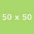

#Encabezado 1
Esto es un párrafo  
esto es otra línea estamos en la misma línea  
Tercera línea
##Encabezado 2
###Encabezado 3
####Encabezado 4
otro encabezado
===
encabezado segundo nivel sólo
---
> En un lugar de la mancha de cuyo nombre no quiero acordarme... -Miguel de Cervantes Saavedra  
>> cita dentro de otra cita  

Ya estamos fuera de la cita, es otro párrafo  
Ahora crearemos unas listas  
\*Lista desordedana (No funciona con \* )
- Lista desordenada  
- Segundo elemento
+ Tercer elemento
    + Subelemento de lista
    + segundo subelemento  

Ahora listas ordenadas  
1. Primer elemento  
2. Segundo elemento  
3. Tercer elemento de la lista  
4. Cuarto elemento  
    + subelemento de lista  
    + otro subelemento  
  
Ahora código:  
~~~
<html>
<head>
</head>
    <body>
    </body>
</html>
~~~
A continuación crearemos una regla horizontal para separar las secciones primero con asteriscos '*'
***
Ahora otra regla pero con tripe guión bajo
_ _ _
Otra forma más con tres guiones seguidos pero separados por un espacio
- - -
Para los elementos de línea
Queremos una palabra en cursiva con *asteriscos* y con _subiguiones_ y otra en **negrita** y __negrita2__.  
Ahora en ***negrita y cursiva*** o bien ___negrita+cursiva___.  
#### Links o enlaces  
Si lo queremos como elemento de línea [batoi](http://www.cipfpbatoi.es) entonces sería clicar e ir.  
Si ahora lo queremos como "referencia" tendremos que poner [google][url_google] para después escribir lo que queramos y poner [url_google]: https://www.google.es  
Ahora un enlace automático <http://marca.es>  
#### Para el código  
Pondremos  entonces se mostrará el texto si no se encuentra la imágen.  
  
Es posible poner también   
o bien poner un enlace por referencia  
Introducimos una imagen usando el editor   
Ahora insertamos código usando el editor:
```css
.importante {
    border: 1px solid black;
    font-size: 1em;
}
```
